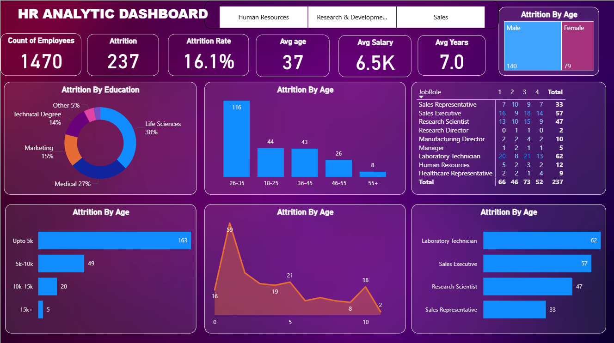

# HR Analytics Dashboard 📊

## Overview

This project presents an HR Analytics Dashboard built using Power BI to analyze employee attrition and workforce trends. The dashboard helps identify patterns related to employee turnover, salary distribution, job roles, and demographics to support HR decision-making.

## Tools Used

* Power BI
* Data Visualization
* Advanced Excel

## Key Insights

* Total Employees: **1470**
* Attrition Count: **237**
* Attrition Rate: **16.1%**
* Highest attrition occurs in the **26–35 age group**
* Most attrition occurs in **lower salary ranges**

## Dashboard Preview

## Repository Files

* **hr_analytics_dataset.csv** - Dataset used for analysis
* **hr_analytics_dashboard.pbix** – Power BI dashboard file
* **dashboard_preview.png** – Dashboard preview image
